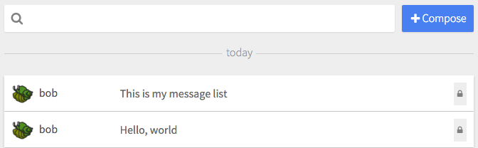

# Message List

Infinite-scrolling view of SSB messages



```jsx
import MsgList from 'patchkit-msg-list'
import Card from 'patchkit-msg-view/card'
import Thread from 'patchkit-flat-msg-thread'
import TopNav from './my-top-nav'
import LeftNav from './my-left-nav'
import RightNav from './my-right-nav'

// message-source function
const source = (opts) => {
  return ssb.createLogStream(opts)
}

// convert a message object to a gt/gte for the source() call
// - used when needing to load more
const cursor = msg => {
  if (msg)
    return [msg.ts, false]
}

<MsgList
  threads
  dateDividers
  TopNav={TopNav} topNavProps={{ ... }}
  LeftNav={LeftNav} leftNavProps={{ ... }}
  RightNav={ThisRightNav} rightNavProps={{ ... }}
  ListItem={Card} listItemProps={{ ... }}
  Thread={Thread}
  live={{ gt: [Date.now(), null] }}
  emptyMsg={'Your feed is empty.'}
  source={source}
  cursor={cursor} />
```

Options:

  - `ListItem`: React component to render each list item (required).
  - `Thread`: React component to render an expanded list item (optional).
  - `TopNav`: React component to render above the list (optional).
  - `LeftNav`: React component to render on the left of the list (optional).
  - `RightNav`: React component to render on the right of the list (optional).
  - `Append`: React component to render at the bottom of the list, when there's nothing more to load (optional).
  - `listItemProps`: Properties to pass to ListItem on render.
  - `topNavProps`: Properties to pass to TopNav on render.
  - `leftNavProps`: Properties to pass to LeftNav on render.
  - `rightNavProps`: Properties to pass to RightNav on render.
  - `threadProps`: Properties to pass to Thread on render.
  - `emptyMsg`: String or elements to render if `source()` returns nothing.
    
  - `batchLoadAmt`: Number of messages to load each time the user scrolls to the bottom.
  - `live`: Run a live-stream? If an object, will be passed into `source()` in the live-stream call.
  - `threads`: Fetch thread data?
  - `queueNewMsgs`: Queue new messages instead of immediately inserting them? (Only applies if `live` is truthy.)
  - `showMissing`: Render messages that don't have a value?
  - `dateDividers`: Render date dividers?
  - `forceRaw`: Force all messagse to render in raw mode?

  - `source`: Function to load messages from (must return a pull-stream source).
  - `filter`: Filter on messages (must return a bool).
  - `cursor`: Function to convert message objects to a value the `source` function can accept in its `gt` parameter.


## Styles

Use the .less file:

```less
@import "node_modules/patchkit-msg-list/styles.less"
```